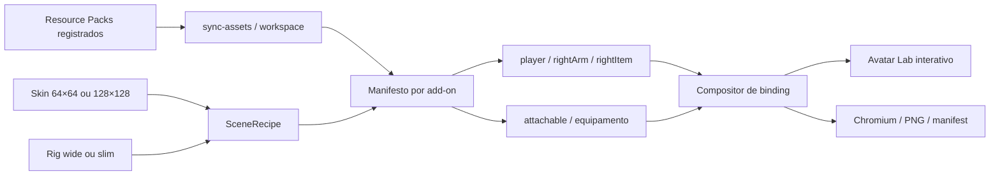

# Avatar Lab

## Finalidade

O Avatar Lab é uma ferramenta de desenvolvimento local multi-add-on para montar um jogador, aplicar uma skin, resolver um equipamento real do Resource Pack, executar sua apresentação disponível e produzir evidência visual reproduzível. Aspergillum usa o perfil avançado já calibrado em `rightItem`; Ornatum e projetos futuros usam composição genérica por bones para equipamentos de cabeça, peito e mão. A ferramenta não entra no `.mcaddon`, não altera `assets-src/`, `packs/` ou gameplay e não cria uma segunda fonte autoritativa.

Execute `npm --prefix viewer-3d run dev` e abra `http://127.0.0.1:4173/?tool=avatar` para usar o Avatar Lab dentro do 3D Workbench. A bancada troca entre os três laboratórios sem recarregar o documento e preserva receita, câmera, pose e controles. `viewer-3d/avatar-lab.html` permanece como adaptador autônomo para isolamento, compatibilidade e captura headless. Pela raiz, use:

```powershell
npm run capture:avatars -- --help
```

## O que a ferramenta monta



No perfil avançado do Aspergillum, o scene graph preserva a cadeia:

```text
player.root
└── waist
    └── body
        └── rightArm
            └── rightItem
                └── aspergillum_bound
                    └── aspergillum_presentation
                        └── aspergillum_action
                            ├── handle
                            └── sprinkler_head
                                └── spray_aim / aspergillum_tip
```

Em equipamentos genéricos, `avatar-equipment.js` encontra cada branch cujo nome coincide com um bone do player e o enxerta com offset local zero, reproduzindo merge-by-bone inclusive em hierarquias aninhadas. Roots e filhos sem bone correspondente permanecem ligados ao branch autorado mais próximo. Em seguida, uma transformação de base única converte a frente canônica dos attachables para a frente visual `+Z` da skin. Essa operação é aplicada ao grafo inteiro, nunca como offset específico de um item.

O adaptador de geometria em `viewer-3d/src/shared/bedrock-geometry.js` é compartilhado por Model Lab, Bedrock Renderer e Avatar Lab. Ele cria bones sem estado global, respeita pivôs/parents, preserva faces UV omitidas, suporta nomes sem diferença de caixa e devolve registros de meshes, pivôs, locators e materiais. Geometria estática e canais de animação possuem conversões deliberadamente separadas. A geometria usa Euler `ZYX` para realizar a ordem Bedrock x→y→z, centro do cubo quando não há pivot e valores `1.12` como serializados; o player local e o perfil avançado conservam sua base retrocompatível explicitamente.

Essa separação corrige três classes de falha que se pareciam visualmente: ausência da transformação de base fazia mitras e báculos aparecerem atrás; preservar `sourcePivot-targetPivot` num branch merged deslocava wearables cujo `Head` legado tinha pivot zero; reutilizar sinais de rotação de animação em cubos estáticos desmontava os painéis rotacionados do barrete. Testes cobrem a frente `-Z→+Z`, o merge de um `Head [0,0,0]` e os quatro painéis reais do barrete `1.12`.

## Binding e calibração

O pack continua sendo a autoridade para os três valores protegidos:

- formato de geometria `1.16.0`;
- raiz neutra `aspergillum_bound`;
- expressão exata `q.item_slot_to_bone_name(context.item_slot)`.

O compositor não grava translação artística no osso vinculado. Para sobrepor no Three.js dois scene graphs independentes, ele usa o grip empírico `[-6, 24, 1]` já aprovado no Minecraft e resolve a diferença entre o binding nativo — que conserva vértices no espaço do modelo do jogador — e dois graphs Three.js comuns.

Em terceira pessoa, o offset autorado `[5, -1.5, -2.25]` torna-se `[-5, -1.5, -2.25]` no perfil visual. Como player e attachable já foram enxertados como graphs independentes pelo centro autorado do grip `[-6, 24, 1]`, a costura absorve integralmente esse offset depois de avaliá-lo. O resultado exigido no espaço local de `rightItem` é `[0, 0, 0]`: o eixo do couro atravessa o centro da mão, em vez de apenas tocar sua face externa. Essa compensação existe somente no compositor web e não altera os JSONs do pack.

O teste anterior aceitava `-3` unidades no eixo lateral porque uma OBB do cabo ainda tocava `0,125` unidade da manga. As ampliações do vídeo e do viewer demonstraram que isso era um falso positivo: contato de volumes não prova empunhadura. O contrato atual exige simultaneamente erro central máximo de `0,05` unidade, centro do grip contido na mão e âncora da mão contida no volume do cabo. O scene trace registra separadamente:

- pivot de `rightItem` para wide ou slim;
- grip empírico do attachable;
- offset de apresentação autorado no pack;
- offset convertido, offset final zero e compensação exclusiva do compositor;
- matrizes locais e mundiais de `rightArm`, `rightItem`, `bound`, `presentation` e `action`;
- erro da costura, offset XYZ do centro, contenção bidirecional mão–grip e colisões OBB entre `sprinkler_head` e `head/hat`.

Isso torna um desalinhamento observável sem transformar a calibração da ferramenta em mudança no add-on. Erro diferente de zero reprova a composição local, mas erro zero ainda não substitui o teste no Minecraft.

## Avatar e skin padrão

O preset padrão é `Batina preta com pelerine`, copiado para a biblioteca exclusiva do viewer:

```text
viewer-3d/public/avatar-library/batina_preta_com_pelerine.png
```

Contrato do preset:

| Campo | Valor |
| --- | --- |
| Resolução | `128 × 128` |
| Perfil | `wide`, braço clássico de 4 px |
| SHA-256 | `b2ad2e38d47616f9f5b245d212786cfc64a15097845fc63c9127d97cbc11ae2b` |
| Escopo | somente ferramenta de desenvolvimento |

O importador aceita PNG moderno `64 × 64` ou `128 × 128`. Ele sugere wide/slim pelas regiões transparentes reservadas dos braços, mas mantém o seletor explícito porque uma textura sozinha nem sempre prova o modelo corporal. O preset fornecido foi verificado como wide.

O runtime expande o layout compacto da skin em seis faces explícitas por cubo. Na convenção visual do avatar, `+Z` recebe a frente do rosto e da roupa, `-Z` recebe as costas e as laterais também são atribuídas explicitamente. Isso evita tratar o Box UV genérico de uma geometria Bedrock como se já fosse o atlas específico de jogador; o adaptador usado pelos modelos do pack permanece inalterado.

## Animações

O jogador e o attachable permanecem em escopos distintos:

- `idle` em terceira pessoa: pose vanilla de item segurado, com `rightArm.x = -18°`;
- `load`: envelope Hermite do add-on por `1,10 s`, somente em `rightArm`, com peso `1,0` em terceira pessoa e `0,32` em primeira;
- `sprinkle`: swing vanilla de `0,90 s`, ponte de recuperação em `rightArm.y` apenas em terceira pessoa e animação local do `aspergillum_action` por `0,82 s`;
- primeira pessoa: pose `first_person.empty_hand` e curva `first_person.attack_rotation` do player Bedrock, câmera ocular em `27,41` unidades, FOV vertical `70,25°` e hold/action FP do attachable;
- hold FP/TP, offsets de apresentação e keyframes locais são carregados dos JSONs sincronizados do Resource Pack, não duplicados na interface.

Play, pause, velocidade e scrub da timeline funcionam no browser. Capturas headless fixam o tempo e são determinísticas em relação aos mesmos inputs.

## Interface

O modo interativo oferece:

- seleção persistente de add-on sem reload e equipamento agrupado por família;
- preset ou importação de skin;
- rig wide/slim;
- acabamentos e PBR somente quando o projeto os declara;
- material clássico ou PBR com color, normal e MERS;
- terceira pessoa e viewmodel Bedrock de primeira pessoa;
- ações segurando, carregando e aspergindo;
- camadas externas da skin;
- grade, pivôs, locators, hierarquia óssea e wireframe;
- órbita, pan, zoom, enquadramento e atalhos;
- receita de cena e matrizes copiáveis em JSON.

O modo de primeira pessoa usa a pose e a curva vanilla do player, além da câmera de referência do preview multi-file. Ele continua sem duplicar hand bob, shader, near plane e efeitos proprietários do cliente. Para comparação com gameplay, prefira capturas `16:9`; uma captura quadrada corta deliberadamente as laterais do viewmodel.

## Captura reproduzível

Exemplos:

```powershell
# pose padrão em cinco vistas
npm run capture:avatars -- --action idle

# sequência completa da aspersão nos tempos diagnósticos padrão
npm run capture:avatars -- --action sprinkle --views front-right,grip,head

# prova macro da empunhadura nos dois lados, com pivôs visíveis
npm run capture:avatars -- --action sprinkle --times 0,0.25,0.5,0.75 --views grip-front,grip-inside,grip-outside,grip-back --size 1600 --pivots

# frames escolhidos da carga
npm run capture:avatars -- --action load --times 0,0.25,0.46,0.54,0.78,1.1

# outra skin e rig slim
npm run capture:avatars -- --skin C:\caminho\skin.png --model slim --action sprinkle

# prova do viewmodel de primeira pessoa em 16:9
npm run capture:avatars -- --action sprinkle --perspective first --views first-person --width 1280 --height 720

# barrete Ornatum no avatar, incluindo close frontal e traseiro do equipamento
npm run capture:equipment -- --addon ornatum --equipment barretepadre --views front,back,equipment,equipment-front,equipment-back --size 1024

# báculo Ornatum com a skin padrão, em terceira pessoa
npm run capture:equipment -- --addon ornatum --equipment baculodourado1 --views front-right,right,back --size 1024
```

Sem `--output`, a execução cria `out/avatar-captures/<addon>/<timestamp>/`. A pasta é descartável e ignorada pelo Git.

```text
out/avatar-captures/<addon>/<run>/
├── capture-manifest.json
├── contact-sheet.png
├── sprinkle-0-180s-front-right.png
├── sprinkle-0-180s-grip.png
└── ...
```

O manifest registra projeto/versão, equipamento e perfil resolvidos, versões de Three.js/Playwright/API, hash e dimensões da skin, hashes do manifesto/geometria/attachable/animações sincronizados, configuração, câmera, tempo, matrizes e composição. No perfil avançado, `allFramesGripCentered`, `allFramesGripEngaged` e `allFramesHeadClear` resumem critérios independentes; em composição genérica o manifest registra `merge_by_bone`, branches enxertados e erro de binding zero, sem fingir que um teste especializado de grip existe para todo formato legado.

## Evidência de paridade de 11 de agosto de 2026

A gravação fornecida para esta correção mede `1918 × 1004`, contém 1.042 frames de vídeo a 30 fps e tem SHA-256 `e5c5aabc74d954da46a9220c608f801dee3c90dadb8d03cc32ac02ced2989c23`. Dois trechos foram usados como oráculo observado:

- primeira pessoa, aproximadamente `28,75–29,65 s`: o instrumento parte do canto inferior direito, cruza para o centro durante a liberação e retorna continuamente;
- terceira pessoa frontal, aproximadamente `32,50–33,40 s`: braço e instrumento projetam-se para fora, sem atravessar rosto, chapéu ou tórax.

A varredura diagnóstica equivalente usa 28 amostras de `0,033 s` entre `0` e `0,90 s`. A reauditoria de empunhadura substituiu o antigo “algum contato OBB” pelo centro autorado: todas as amostras devem registrar `gripCenterOffset: [0, 0, 0]`, contenção bidirecional e binding zero. Colisões de cabeça continuam registradas como um eixo separado da análise de movimento. A gravação e os PNGs continuam evidência local descartável; o pack e as animações aprovadas não foram alterados.

## Relação com o Sacristia

`C:\Users\fabio\Projects\skins\sacristia` foi auditado como referência, sem receber alterações. Ele contribuiu com padrões úteis de importação/preload de skins, câmera responsiva, pausa quando invisível, pixel ratio limitado, reduced motion e fallback de estado.

O Avatar Lab não depende de `skinview3d` nem importa o renderer do Sacristia. A versão observada usa Three.js `0.156.1`, enquanto este viewer fixa `0.185.1`, e seu rig é voltado à exibição de skins, sem o holder Bedrock `rightItem` e sem a semântica de attachables. Manter o runtime próprio evita duas cópias incompatíveis do Three.js e permite testar a hierarquia real do add-on.

## Limites e próximos encaixes

Já existe um contrato de cena extensível para adicionar, sem trocar o núcleo:

- mão esquerda e offhand;
- capas, elytra e armor layers;
- poses de caminhada, agachamento e uso;
- novos add-ons registrados, attachables e itens sem código específico por asset;
- efeitos no locator como camada de apresentação;
- golden captures por skin/modelo/perspectiva;
- diff de pixels entre duas revisões com inputs idênticos.

Persona, geometria customizada de Character Creator, shader proprietário, iluminação do mundo, partículas completas, culling e câmera final continuam dependentes do Minecraft. A ferramenta reduz o espaço de hipóteses e produz evidência; não promove uma prévia web a oráculo visual.
