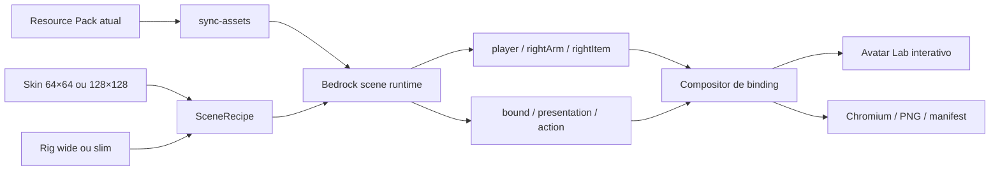

# Avatar Lab

## Finalidade

O Avatar Lab é uma ferramenta de desenvolvimento local para montar um jogador, aplicar uma skin, vincular o attachable real do aspersório ao holder `rightItem`, executar as animações aprovadas e produzir evidência visual reproduzível. Ele não entra no `.mcaddon`, não altera `assets-src/`, `packs/` ou estado de gameplay e não cria uma segunda fonte autoritativa para o item.

Abra `viewer-3d/avatar-lab.html` com `npm --prefix viewer-3d run dev` ou use a captura headless pela raiz:

```powershell
npm run capture:avatars -- --help
```

## O que a ferramenta monta



O scene graph resultante preserva a cadeia:

```text
player.root
└── waist
    └── body
        └── rightArm
            └── rightItem
                └── aspergillum_bound
                    └── aspergillum_presentation
                        └── aspergillum_action
                            ├── handle
                            └── sprinkler_head
                                └── spray_aim / aspergillum_tip
```

O adaptador de geometria em `viewer-3d/src/shared/bedrock-geometry.js` é compartilhado por Model Lab, Fidelity Renderer e Avatar Lab. Ele cria bones sem estado global, respeita pivôs e parents, preserva faces UV omitidas, suporta nomes de bone sem diferença de caixa e devolve registros de meshes, pivôs, locators e materiais para inspeção.

## Binding e calibração

O pack continua sendo a autoridade para os três valores protegidos:

- formato de geometria `1.16.0`;
- raiz neutra `aspergillum_bound`;
- expressão exata `q.item_slot_to_bone_name(context.item_slot)`.

O compositor não grava translação artística no osso vinculado. Para sobrepor no Three.js dois scene graphs independentes, ele usa o grip empírico `[-6, 24, 1]` já aprovado no Minecraft e normaliza a translação de apresentação da perspectiva somente na composição da ferramenta. O scene trace registra separadamente:

- pivot de `rightItem` para wide ou slim;
- grip empírico do attachable;
- offset de apresentação autorado no pack;
- compensação exclusiva do compositor;
- matrizes locais e mundiais de `rightArm`, `rightItem`, `bound`, `presentation` e `action`;
- erro de contato entre `rightItem` e o grip composto.

Isso torna um desalinhamento observável sem transformar a calibração da ferramenta em mudança no add-on. Erro diferente de zero reprova a composição local, mas erro zero ainda não substitui o teste no Minecraft.

## Avatar e skin padrão

O preset padrão é `Batina preta com pelerine`, copiado para a biblioteca exclusiva do viewer:

```text
viewer-3d/public/avatar-library/batina_preta_com_pelerine.png
```

Contrato do preset:

| Campo | Valor |
| --- | --- |
| Resolução | `128 × 128` |
| Perfil | `wide`, braço clássico de 4 px |
| SHA-256 | `b2ad2e38d47616f9f5b245d212786cfc64a15097845fc63c9127d97cbc11ae2b` |
| Escopo | somente ferramenta de desenvolvimento |

O importador aceita PNG moderno `64 × 64` ou `128 × 128`. Ele sugere wide/slim pelas regiões transparentes reservadas dos braços, mas mantém o seletor explícito porque uma textura sozinha nem sempre prova o modelo corporal. O preset fornecido foi verificado como wide.

O runtime expande o layout compacto da skin em seis faces explícitas por cubo. Na convenção visual do avatar, `+Z` recebe a frente do rosto e da roupa, `-Z` recebe as costas e as laterais também são atribuídas explicitamente. Isso evita tratar o Box UV genérico de uma geometria Bedrock como se já fosse o atlas específico de jogador; o adaptador usado pelos modelos do pack permanece inalterado.

## Animações

O jogador e o attachable permanecem em escopos distintos:

- `idle`: pose vanilla de item segurado, com `rightArm.x = -18°`;
- `load`: envelope Hermite do add-on por `1,10 s`, somente em `rightArm`, com peso `1,0` em terceira pessoa e `0,32` em primeira;
- `sprinkle`: swing vanilla de `0,90 s`, ponte de recuperação em `rightArm.y` apenas em terceira pessoa e animação local do `aspergillum_action` por `0,82 s`;
- hold FP/TP, offsets de apresentação e keyframes locais são carregados dos JSONs sincronizados do Resource Pack, não duplicados na interface.

Play, pause, velocidade e scrub da timeline funcionam no browser. Capturas headless fixam o tempo e são determinísticas em relação aos mesmos inputs.

## Interface

O modo interativo oferece:

- preset ou importação de skin;
- rig wide/slim;
- dezesseis acabamentos do catálogo;
- material clássico ou PBR com color, normal e MERS;
- terceira pessoa e viewmodel diagnóstico de primeira pessoa;
- ações segurando, carregando e aspergindo;
- camadas externas da skin;
- grade, pivôs, locators, hierarquia óssea e wireframe;
- órbita, pan, zoom, enquadramento e atalhos;
- receita de cena e matrizes copiáveis em JSON.

O modo de primeira pessoa aplica a pose FP real do attachable e enquadra somente braço e item para avaliar skin, clipping e contato. Ele não afirma reproduzir a câmera proprietária, o hand bob ou o near plane exato do cliente.

## Captura reproduzível

Exemplos:

```powershell
# pose padrão em cinco vistas
npm run capture:avatars -- --action idle

# sequência completa da aspersão nos tempos diagnósticos padrão
npm run capture:avatars -- --action sprinkle --views front-right,grip,head

# frames escolhidos da carga
npm run capture:avatars -- --action load --times 0,0.25,0.46,0.54,0.78,1.1

# outra skin e rig slim
npm run capture:avatars -- --skin C:\caminho\skin.png --model slim --action sprinkle

# prova do viewmodel de primeira pessoa
npm run capture:avatars -- --action idle --views first-person
```

Sem `--output`, a execução cria `out/avatar-captures/<timestamp>/`. A pasta é descartável e ignorada pelo Git.

```text
out/avatar-captures/<run>/
├── capture-manifest.json
├── contact-sheet.png
├── sprinkle-0-180s-front-right.png
├── sprinkle-0-180s-grip.png
└── ...
```

O manifest registra versões do pack, Three.js, Playwright e API de captura; hash e dimensões da skin; hashes da geometria, attachable e animações; hash da configuração; câmera; tempo; matrizes da cadeia e resultado do binding para cada PNG.

## Relação com o Sacristia

`C:\Users\fabio\Projects\skins\sacristia` foi auditado como referência, sem receber alterações. Ele contribuiu com padrões úteis de importação/preload de skins, câmera responsiva, pausa quando invisível, pixel ratio limitado, reduced motion e fallback de estado.

O Avatar Lab não depende de `skinview3d` nem importa o renderer do Sacristia. A versão observada usa Three.js `0.156.1`, enquanto este viewer fixa `0.185.1`, e seu rig é voltado à exibição de skins, sem o holder Bedrock `rightItem` e sem a semântica de attachables. Manter o runtime próprio evita duas cópias incompatíveis do Three.js e permite testar a hierarquia real do add-on.

## Limites e próximos encaixes

Já existe um contrato de cena extensível para adicionar, sem trocar o núcleo:

- mão esquerda e offhand;
- capas, elytra e armor layers;
- poses de caminhada, agachamento e uso;
- outros attachables e itens do addon;
- efeitos no locator como camada de apresentação;
- golden captures por skin/modelo/perspectiva;
- diff de pixels entre duas revisões com inputs idênticos.

Persona, geometria customizada de Character Creator, shader proprietário, iluminação do mundo, partículas completas, culling e câmera final continuam dependentes do Minecraft. A ferramenta reduz o espaço de hipóteses e produz evidência; não promove uma prévia web a oráculo visual.
